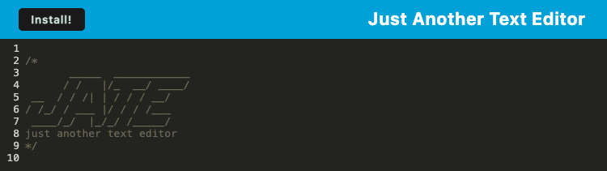
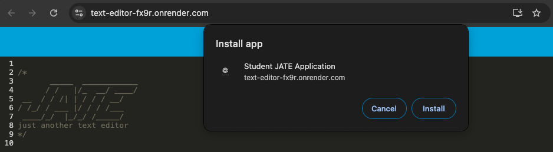
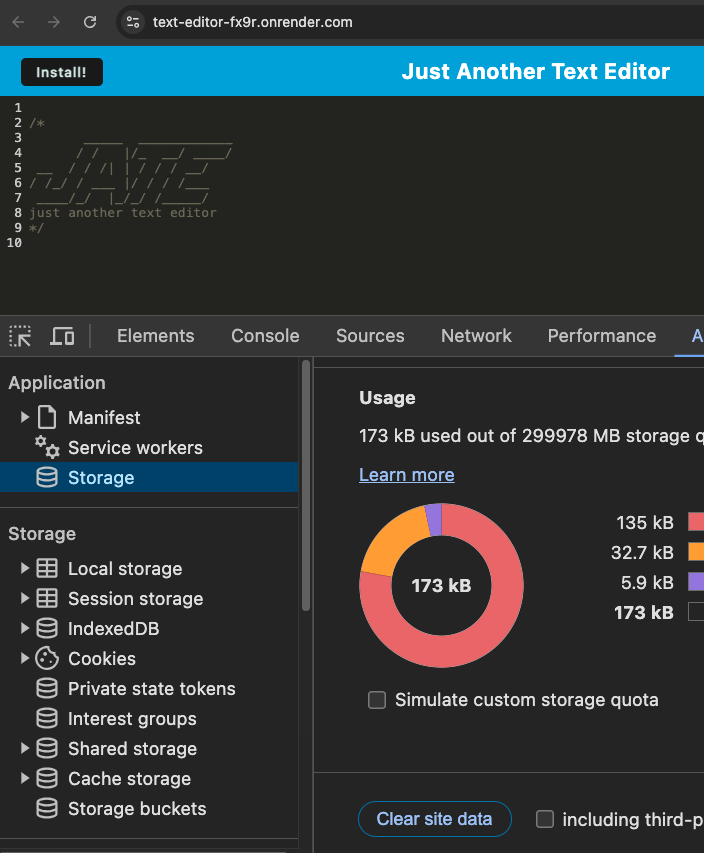

  # J.A.T.E. Text Editor
  
  ## Table of Contents

  1. [Description](#1-description)
  2. [Instructions](#2-instructions)
  3. [Contribution Guidelines](#3-contribution-guidelines)
  4. [Testing the Application](#4-testing-the-application)
  5. [License](#5-license)
  6. [Questions](#6-questions)

  ## 1. Description
  This is a text editor application that you can use for quick note taking and entry. Because this is deployed as a Progressive Web App (PWA), this is usable both offline and online, and can also be installed locally to your computer for use. 

  ## 2. Instructions
Below is a link to the application to get started.

  [JATE Text Application](https://text-editor-fx9r.onrender.com/)
  
This is a very lightweight text editor, so you are able to immediately start utilitizing the application directly in the web browser. Since this application uses Indexed DB, any test entered will persist even when the application is refreshed or closed and reopened. 

The application also allows for the installation to your computer by using the "Install" button on the page. 
 

Once you click the "Install" button, you will be presented with a pop-up to install the application.

  ## 3. Contribution Guidelines
Since the original code was provided, only authorized contributions by the original author are permitted.

  ## 4. Testing the Application
  The application can be tested by directly using the application and checking that data persists when the page is reloaded or reopened. If you need to clear out all of the site data for your local version, you can go into the Dev tools to "Clear site data" in the Application tab.

  

  ## 5. License
  MIT 
  https://opensource.org/licenses/MIT

  ## 6. Questions:
  Contact me with questions at: 
    - Github: *jeremydray* 
    - Email: *jeremydray@gmail.com*
